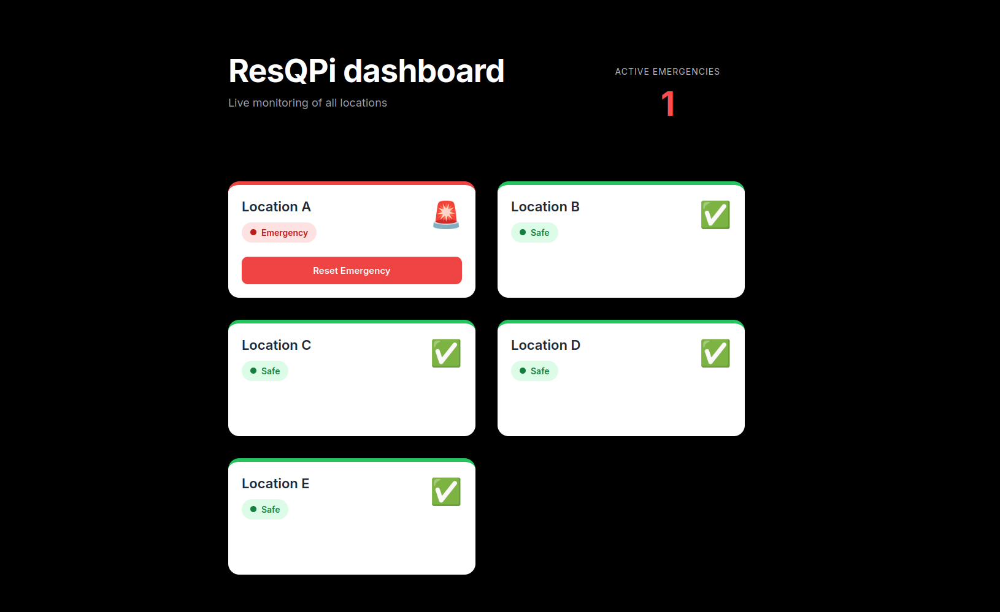

# ResQPI
## About

This project aims to create a detection system for distress signals and send a corresponding notification to authorities/people in charge.

ResQPi utilizes a quantized YOLOv10 model to detect the "call" gesture from the HaGRID dataset - interpreting it as the distress signal.

This project has two executables, sender and receiver. Sender is responsible for camera management and forwarding the frames through UDP while receiver reassembles the frames at the backend and does the inference/potential authority notification.

It also has a webapp dashboard made in Next.js with FastAPI that uses clickhouse as the DB and Redpanda for event streaming
## UI Image

## Build instructions
Consult the README's in each folder

## Todo
Make a docker compose file to maker it easier to setup stuff?

## Citations
[HaGRID Dataset](https://github.com/hukenovs/hagrid)